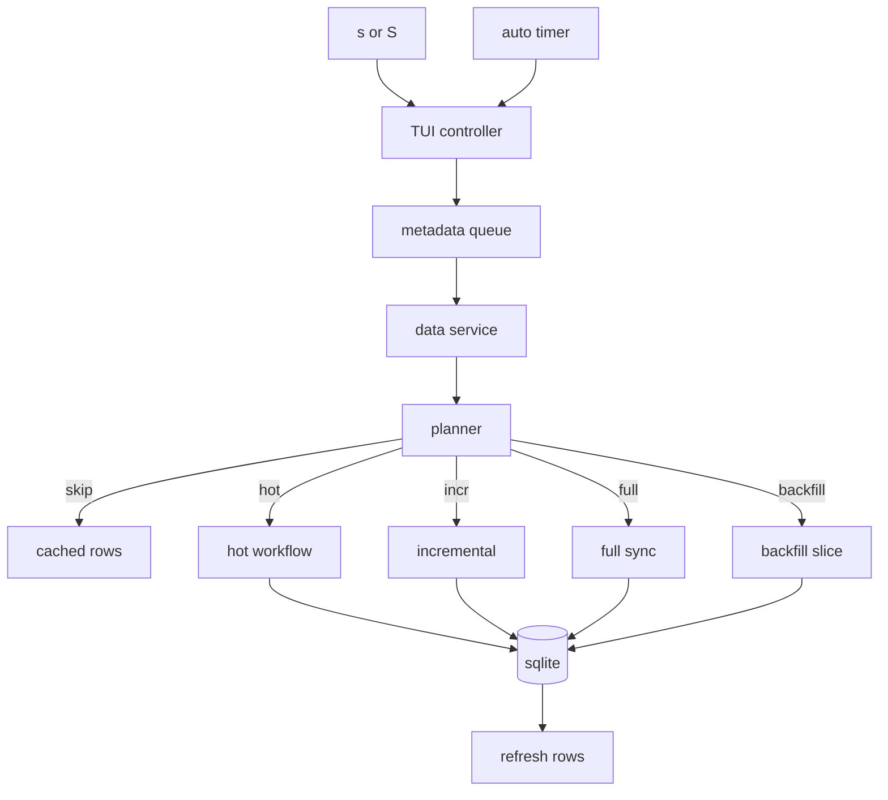
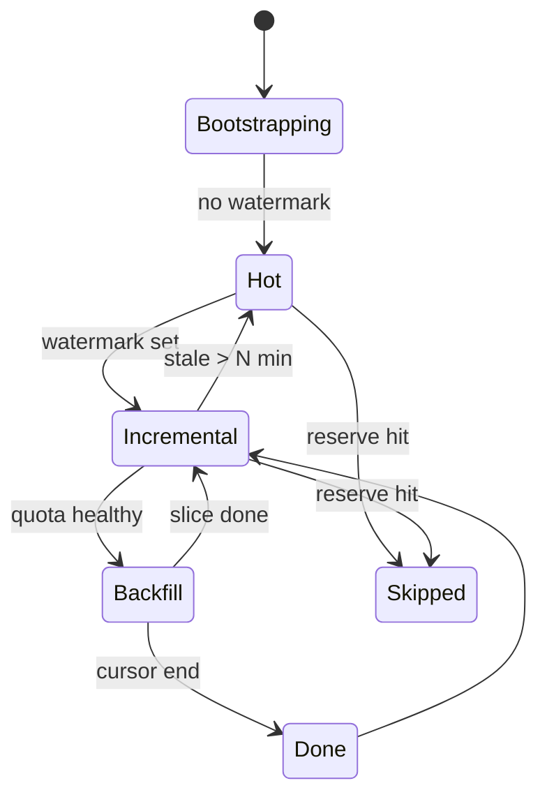

## Context

`clawlens` is a local-first TUI/CLI that indexes GitHub PRs and issues into a SQLite read model. For openclaw-scale repositories (~3000 issues and ~5000 PRs):

- Full sync currently calls `GhCliPullRequestDataSource.listAllPullRequests` and `listAllIssues` without `newestFirst`, so the first paginated fetch is ordered by `created asc`. The TUI bootstrap therefore spends its initial sync time on the oldest items.
- Incremental sync uses `last_sync_watermark` and the `issues?since=` REST endpoint to detect changes since the previous run, which is correct but does nothing on a fresh DB without a watermark.
- TUI landing views (`pr-search`, `issue-search`, `cross-search`) default the cached query to `state:open` (`src/tui/listing.ts:217-261`), hiding newer closed/merged work.
- The TUI controller already maintains a per-entity sync job queue with manual/auto triggers, progress events, and idle replays (`src/tui/controller.ts:2012-2186`).
- `StoreBackedTuiDataService.syncPrs/syncIssues` call `store.sync({ full: false })` and `store.syncIssues({ full: false })` regardless of repo size or quota (`src/tui/data-service.ts:170-186`).
- A rate-limit snapshot is fetched once a minute via `GhCliPullRequestDataSource.getRateLimitStatus` and rendered in the header (`src/tui/controller.ts:88, 2106-2113`).

This design adds a deterministic planner that selects the right sync mode per tick and introduces a non-hydrating "hot" path plus resumable backfill so the TUI can be useful immediately on huge repos without burning quota.

## Goals / Non-Goals

**Goals:**

- The TUI MUST show recent items within one hot pass on a fresh DB for repos with thousands of PRs/issues.
- Sync decisions MUST respect a configurable GitHub API hard reserve and never push remaining quota below it.
- Incremental sync semantics (watermarks, `since`) MUST keep working unchanged for existing flows.
- The planner MUST be a pure function over a snapshot and MUST be unit-testable without network calls.
- All meta key additions MUST be additive; no destructive schema migrations.
- CLI default behavior MUST stay backward compatible.

**Non-Goals:**

- Rewriting sync against GraphQL.
- Adding ETag/`If-Modified-Since` conditional requests in v1.
- Replacing the local SQLite store or the `PrIndexStore` class shape.
- Eagerly hydrating thousands of PRs.
- Driving sync from an LLM agent or external service (the central API change handles that separately).
- Changing Inbox/Watchlist semantics (still `state:open`).

## Decisions

### 1. Planner is a pure decision function, not a service

The planner is a single function `selectSyncDecision(input: PlannerSnapshot): PlannerDecision`. Inputs:

- `entity`: `"prs"` or `"issues"`.
- `trigger`: `"manual"` or `"auto"`.
- `manualOverride`: `"hot" | "incremental" | "full" | "backfill" | null` (used by CLI flags or TUI debug mode).
- `rateLimit`: `{ limit: number; remaining: number; resetAt: string } | null`. May be up to ~60 s stale because `StoreBackedTuiDataService.rateLimit()` caches the snapshot for 60 s; the band reserve is generous enough to absorb the drift.
- `freshness`: `{ lastSyncAt: string | null; lastSyncWatermark: string | null; hotSyncAt: string | null; backfillCursor: number | null; backfillCompletedAt: string | null; }`.
- `activeTuiMode`: the current `TuiMode` (`"pr-search"`, `"issue-search"`, `"cross-search"`, `"inbox"`, `"watchlist"`, or `null` for non-TUI callers).
- `now`: timestamp injected for determinism.

Outputs:

```ts
type PlannerDecision =
  | { kind: "run"; mode: "hot" | "incremental" | "full" | "backfill"; reason: string }
  | { kind: "skip"; reason: "rate_limit_reserve" | "already_fresh" | "backfill_complete" };
```

**Why pure**: it makes the planner trivially unit-testable, removes I/O dependencies, and keeps the controller layer thin. Alternatives considered: an `EventEmitter`-based scheduler (overkill for one decision) and a class that owns rate-limit fetching (entangles concerns).

### 2. Rate-limit bands and staleness threshold

| Remaining quota | Band     | Allowed modes                                              |
|-----------------|----------|------------------------------------------------------------|
| `< 100`         | reserve  | `skip` only                                                |
| `100..499`      | moderate | `hot`, `incremental`                                       |
| `>= 500`        | healthy  | `hot`, `incremental`, `full`, `backfill` (one slice/tick)  |
| `null` snapshot | moderate | treat as moderate, never `backfill`                        |

Bands are constants on the planner module. Tunable later, but the reserve is a hard floor.

The planner also uses a fixed staleness threshold `STALE_WATERMARK_MS = 15 * 60 * 1000` (15 minutes). The freshness rule:

- If no `lastSyncWatermark` is set, the planner prefers `hot` (or `full` only with explicit `manualOverride`).
- If `lastSyncWatermark` is set and `now - lastSyncAt <= STALE_WATERMARK_MS`, the planner picks `incremental`.
- If `lastSyncWatermark` is set and `now - lastSyncAt > STALE_WATERMARK_MS`, the planner picks `hot` first so visible rows refresh quickly; the next tick can settle to `incremental` once `pr_hot_sync_at` advances.
- `backfill` is considered only after the chosen mode for the current tick is satisfied and quota remains healthy.

Both `RATE_LIMIT_RESERVE`, `RATE_LIMIT_BACKFILL_FLOOR` (500), and `STALE_WATERMARK_MS` live as exported constants on the planner module so tests can assert them and ops can swap them via constant change.

### 3. Hot metadata sync writes only summary fields

Hot sync extends `syncPullRequestsWorkflow`/`syncIssuesWorkflow` with a new branch (`mode === "hot"`) that:

1. Calls `listAllPullRequests`/`listAllIssues` with `sort: "updated", direction: "desc"`.
2. Stops after a hot page budget (default 5 pages × 100 = ~500 rows).
3. Calls `upsertPullRequestSummary(pr, "partial")` / `upsertIssue(issue)` only.
4. Does NOT call `hydratePullRequest`, `prewarmPullRequestFacts`, or any comment fetch.
5. Persists a new meta key `pr_hot_sync_at` / `issue_hot_sync_at` (ISO timestamp).
6. **MUST NOT** mutate `last_sync_watermark` or `issue_last_sync_watermark`. This preserves incremental correctness.

Alternative considered: collapse hot into a special `full` mode with a row cap. Rejected because hot's contract is "metadata only, never hydrate", which `full` does not guarantee.

### 4. Resumable backfill uses page cursors

Backfill walks the historical end of the `created asc` list using existing `listAllPullRequests`/`listAllIssues` semantics, but a cursor controls which page to fetch next. New meta keys:

- `pr_backfill_cursor` / `issue_backfill_cursor`: integer page number (1-based).
- `pr_backfill_completed_at` / `issue_backfill_completed_at`: ISO timestamp set when a page returns fewer than `PAGE_SIZE` items.

A backfill slice fetches `BACKFILL_PAGES_PER_SLICE = 2` pages, upserts summary rows, advances the cursor only after success, and sets the completion sentinel when GitHub returns the final partial page.

Alternative considered: backfill by date range. Rejected because the REST `pulls` endpoint does not accept `since` and date filtering would require search API quota.

### 5. Sort and paging require new data-source options

Today `listAllPullRequests` and `listAllIssues` only accept `{ limit?: number; newestFirst?: boolean }`. `newestFirst: true` produces `sort=created&direction=desc`, which is the wrong ordering for hot sync (newest-created vs newest-updated). The backfill workflow also needs to resume from an explicit page rather than always restarting at `page=1`.

We extend the options to:

```ts
{
  limit?: number;
  newestFirst?: boolean;
  sort?: "created" | "updated";
  direction?: "asc" | "desc";
  startPage?: number; // 1-based; default 1
}
```

The defaults preserve current behavior. `GhCliPullRequestDataSource` forwards `sort`/`direction` into the URL and starts its `for (let page = startPage ?? 1; ...)` loop from `startPage` so backfill can resume from `META_PR_BACKFILL_CURSOR`. `newestFirst` remains for back-compat callers; if both `newestFirst` and `sort`/`direction` are provided, the explicit `sort`/`direction` wins.

### 6. Planner integration and dispatcher in the TUI

`StoreBackedTuiDataService.syncPrs/syncIssues` becomes the dispatcher. It is the only place that converts a `PlannerDecision` into a real store call or a synthesized skipped summary; the planner module itself never touches `PrIndexStore`.

```ts
async syncPrs(options?: { onProgress?: ...; trigger?: "manual" | "auto" }): Promise<SyncSummary> {
  if (process.env.CLAWLENS_SYNC_PLANNER === "off") {
    return this.store.sync({ repo: this.repo, source: this.source, full: false, hydrateAll: false, onProgress: options?.onProgress });
  }
  const snapshot = await this.buildPlannerSnapshot("prs", options?.trigger ?? "manual");
  const decision = selectSyncDecision(snapshot);
  if (decision.kind === "skip") {
    return this.makeSkippedSummary("prs", decision.reason);
  }
  switch (decision.mode) {
    case "full":
      return this.store.sync({ repo: this.repo, source: this.source, full: true, hydrateAll: false, onProgress: options?.onProgress });
    case "incremental":
      return this.store.sync({ repo: this.repo, source: this.source, full: false, hydrateAll: false, onProgress: options?.onProgress });
    case "hot":
      return this.store.syncHotPullRequests({ repo: this.repo, source: this.source, onProgress: options?.onProgress });
    case "backfill":
      return this.store.runBackfillSlice({ entity: "prs", repo: this.repo, source: this.source, onProgress: options?.onProgress });
  }
}
```

`makeSkippedSummary` is local to the data service. It constructs:

```ts
type SkippedSyncSummary = SyncSummary & {
  mode: "skipped";
  reason: "rate_limit_reserve" | "already_fresh" | "backfill_complete";
};
```

The TUI controller already routes manual `s`/`S` through `queueMetadataSync(...)` and auto sync through `scheduleAutoSync(...)`. Both call `effects.syncPrs/syncIssues`, which makes the data service the only seam we need to change. `TuiDataService` and `TuiEffects` get a new `options?.trigger: "manual" | "auto"` field so the planner can distinguish them; existing callers keep working because the option is optional.

`SyncSummary` extends from `{ mode: "full" | "incremental"; ... }` to:

```ts
type SyncSummary =
  & { entity: "prs" | "issues"; repo: string }
  & {
      mode: "full" | "incremental" | "hot" | "backfill" | "skipped";
      processedPrs: number;
      processedIssues: number;
      skippedPrs: number;
      skippedIssues: number;
      docCount: number;
      commentCount: number;
      labelCount: number;
      vectorAvailable: boolean;
      lastSyncAt: string | null;
      lastSyncWatermark: string | null;
      reason?: "rate_limit_reserve" | "already_fresh" | "backfill_complete";
      nextBackfillCursor?: number | null;
    };
```

`lastSyncAt` and `lastSyncWatermark` move to `string | null` so the `skipped` and `backfill` cases can return without lying about authoritative incremental state. Existing producers in `syncPullRequestsWorkflow` continue to return strings for `full`/`incremental`. The `TuiController.drainMetadataJobs` bookkeeping switches off `summary.mode` for `totalKnown`, `lastCompletedAt`, `nextAutoUpdateAt`, and the "running rerun" decision; `skipped` jobs MUST NOT advance `nextAutoUpdateAt` so the auto-sync timer retries when quota recovers.

### 7. Landing query defaults

`src/tui/listing.ts` currently hardcodes `const searchQuery = query || "state:open"` in three places. We replace those with `"state:all"` for `pr-search`, `issue-search`, and `cross-search`. Inbox and Watchlist already use `listPriorityInbox`/`listWatchlist` (open-only by design) and are not touched.

Landing copy in `src/tui/format/detail.ts` switches from "Showing cached open ${plural}" to "Showing recent cached ${plural}". Explicit `state:open` queries still work because `parseSearchQuery` already supports them.

### 8. Status snapshot extensions

`StatusSnapshot` already exposes sync timestamps. We add additive fields:

- `prHotSyncAt: string | null`
- `issueHotSyncAt: string | null`
- `prBackfillCursor: number | null`
- `prBackfillCompletedAt: string | null`
- `issueBackfillCursor: number | null`
- `issueBackfillCompletedAt: string | null`

These are populated from new meta keys. The TUI header and Status pane render them with the existing freshness/age helpers.

### 9. CLI surface routes through the planner

`src/cli.ts` accepts `--hot` and `--backfill` for `sync` and `sync-issues`. They are mutually exclusive with `--full`. Without any flag, behavior is unchanged (incremental or initial full).

CLI flags go through the planner with `manualOverride`, not directly to store methods, so the rate-limit reserve and feature flag rules apply uniformly:

```ts
const decision = selectSyncDecision({
  entity: "prs",
  trigger: "manual",
  manualOverride: args.hot ? "hot" : args.backfill ? "backfill" : args.full ? "full" : null,
  rateLimit: await source.getRateLimitStatus(),
  freshness: await loadFreshness(store, "prs"),
  activeTuiMode: null,
  now: Date.now(),
});
```

The CLI dispatches the decision through the same helper used by the data service. On a `skip` decision, the CLI prints the standard summary lines plus a `reason: rate_limit_reserve` line and exits with status `0` (consistent with current "no work" semantics for empty incremental runs).

`pnpm clawlens status` already prints meta keys; we add the new hot/backfill values to the printed lines.

### 10. Feature flag for rollback

A boolean env var `CLAWLENS_SYNC_PLANNER` defaults to `on`. Setting it to `off` makes `StoreBackedTuiDataService.syncPrs/syncIssues` fall back to the legacy `store.sync({ full: false })` and `store.syncIssues({ full: false })`. The hot/backfill code paths and new meta keys remain dormant in that mode.

## Data Flow





## Risks / Trade-offs

- **Watermark corruption** → Hot sync writes only `*_hot_sync_at`; unit tests assert `last_sync_watermark` is unchanged after a hot pass.
- **Quota thrash from auto sync** → Reserve is hard-coded at 100, with a planner unit test guarding the band table.
- **Backfill loop on a corrupted cursor** → Cursor advances only on a fully successful page; backfill is bounded to `BACKFILL_PAGES_PER_SLICE` per tick.
- **`state:all` default reveals noise** → Maintainer can still type `state:open`. Inbox/Watchlist remain open-only.
- **`getRateLimitStatus` returns null** → Planner treats it as moderate, never schedules backfill, and never blocks the UI.
- **CLI behavior drift** → Default `pnpm clawlens sync` keeps current semantics; new flags are explicit opt-in.

## Migration Plan

1. Land Phase 0 (this OpenSpec change). No code changes.
2. Phase 1: add data-source options, meta keys, and status snapshot fields. Existing tests still pass.
3. Phase 2: add hot workflow behind the planner stub. Planner returns `hot` only when no watermark exists; everything else stays incremental. Validate against fixtures.
4. Phase 3: replace the planner stub with the full decision tree. Add tests for each band and freshness combination.
5. Phase 4: implement backfill cursor and idle backfill scheduling.
6. Phase 5: flip landing defaults to `state:all` and update copy.
7. Phase 6: expose `--hot`/`--backfill` CLI flags and update README.
8. Rollback: set `CLAWLENS_SYNC_PLANNER=off` to revert to legacy behavior at runtime.

## Open Questions

- Should hot sync also refresh `pr_labels` for touched PRs? Currently `upsertPullRequestSummary` already rewrites labels, so this is implicit. Confirm during Phase 2 implementation.
- Do we want a TUI keybinding for "force backfill slice" (e.g. `B`)? Out of scope for v1; reachable via CLI for now.
- Should `gh search prs` be used opportunistically for "currently relevant" rows? Deferred; the search API has its own quota and 1000-result cap that complicates the planner.
